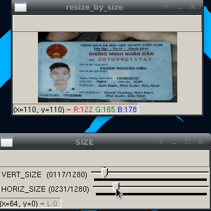
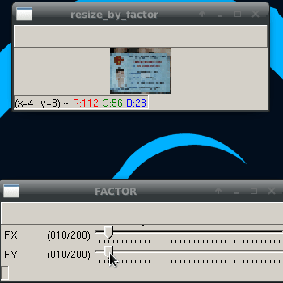
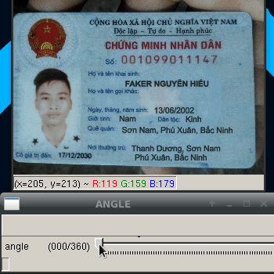
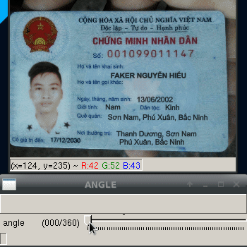
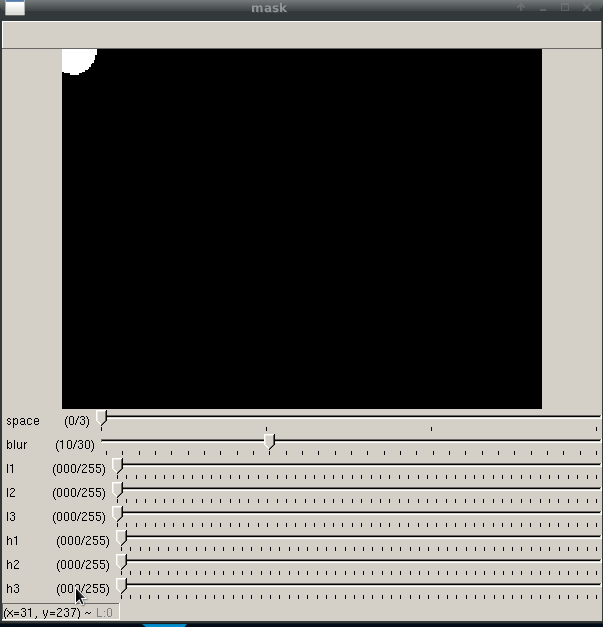
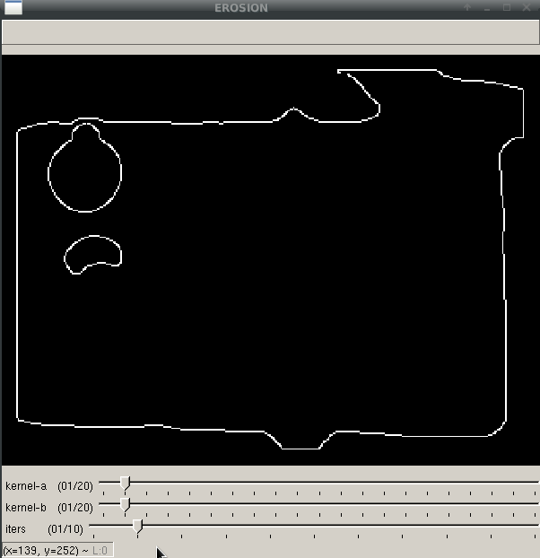
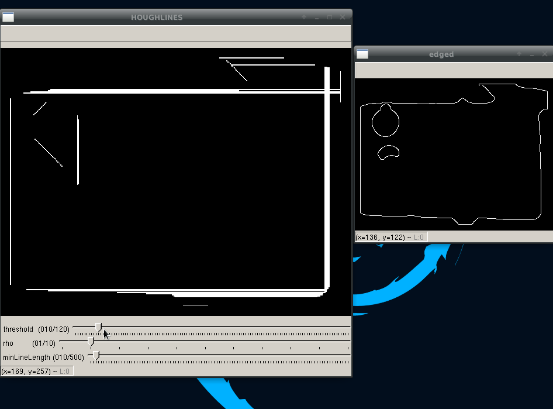
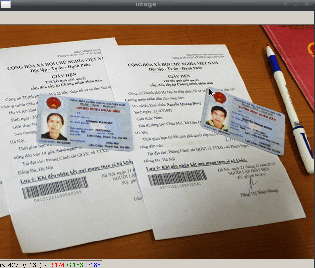

## CVTOOLS

<span style="color:red">**Notes:**</span>
* Any functions that contain parameters have `TP mode` - (Test Params) .<br />
To activate `TP mode` you just need pass `mode="TP"` to the function. <br />
For example:
```python
rotate_remain_bound(image, -3, mode="TP")
```

* To show results pass `show=True` to the function. <br />
For example:
```python
rotate_remain_bound(image, -3, show=True)
```

### Tools
1. resize_by_size
```python
resize_by_size(image, mode="TP")
```


2. resize_by_factor
```python
resize_by_factor(image, mode="TP")
```


3. rotate_by_direction

4. rotate_by_angle
```python
rotate_by_angle(image, mode="TP")
```


5. rotate_remain_bound
```python
rotate_remain_bound(image, mode="TP")
```


6. color_segment
```python
color_segment(image, mode="TP")
```


7. erode
```python
mask = color_segment(image)
padded = padding(mask, 10, 10, 10, 10, show=False)
edges = auto_canny(padded, show=True)
erode(edges, mode="TP")
```


8. detect_houghlines
```python
mask = color_segment(image)
padded = padding(mask, 10, 10, 10, 10, show=False)
edges = auto_canny(padded, show=True)
detect_houghlines(edges, mode="TP")
```


9. perspective_transform

```python
def click_event(event, x, y, flags, param):
    if event == cv2.EVENT_LBUTTONDOWN:
        cv2.circle(image, (x, y), 2, (0, 0, 255), 2)
        cv2.imshow('image', image)
        coords.append(x)
        coords.append(y)

image = cv2.imread('images/idcard2.jpg')
cv2.imshow("image", image)

coords = []
cv2.setMouseCallback('image', click_event)
cv2.waitKey(0)

print(coords)

coordx1, coordy1, coordx2, coordy2, coordx3, coordy3, coordx4, coordy4 = coords

pts1 = np.float32([[coordx1, coordy1], [coordx2, coordy2], [coordx3, coordy3], [coordx4, coordy4]])
pts2 = np.float32([[0, 0], [coordx2-coordx1, 0], [0, coordy3-coordy1], [coordx2-coordx1, coordy3-coordy1]])

matrix = cv2.getPerspectiveTransform(pts1, pts2)
result = cv2.warpPerspective(image, matrix, (coordx2-coordx1, coordy3-coordy1))

result = cv2.resize(result, (0, 0), fx=2, fy=2)

cv2.imshow("result", result)
cv2.waitKey(0)
```

### Requirements
1. OpenCV - [install](https://pypi.org/project/opencv-python/)
2. Numpy - [install](https://pypi.org/project/numpy/)